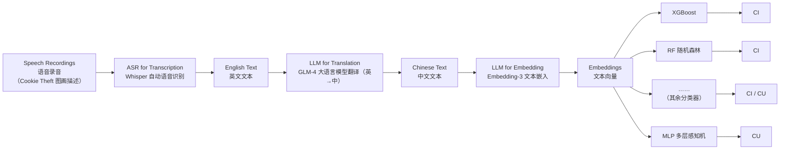

# 基于语音的跨语言认知障碍早期筛查自动分类框架——方法详解文档

> **文档说明**：本文档内容忠实于论文 *An Automatic and Speech-based Cross-Lingual Classification Framework for Early Screening of Cognitive Impairment*（Poster，发表于 Alzheimer's & Dementia 2025 会议摘要增刊）。原文未提供的信息一律标注为「原文未提供」或「解读」，不臆测补充；外部背景知识统一放在「附录 A」并标注来源。

---

## 0. 论文元信息

| 项目 | 内容 |
|---|---|
| **论文标题** | An Automatic and Speech-based Cross-Lingual Classification Framework for Early Screening of Cognitive Impairment（基于语音的跨语言认知障碍早期筛查自动分类框架） |
| **论文类型** | Poster Presentation（会议壁报 / 摘要增刊论文） |
| **发表期刊** | Alzheimer's & Dementia — The Journal of the Alzheimer's Association（美国阿尔茨海默病协会官方期刊，Wiley 出版） |
| **卷期页码** | Alzheimer's Dement. 2025; 21(Suppl. 2): e099314 |
| **DOI** | 10.1002/alz.70856_099314（海报印刷版标注为 alz70856,099314） |
| **第一作者** | Yue Wu（吴悦）¹ |
| **通讯作者** | Yue Wu，北京大学深圳医院，Email: wuy2021@mail.sustech.edu.cn |
| **作者单位** | ¹ 北京大学深圳医院；² 香港中文大学（深圳）；³ 东莞理工学院 |
| **核心内容** | 用「语音 → ASR → LLM 翻译 → 文本嵌入 → 机器学习分类」的自动化流水线，实现认知障碍（CI）的早期筛查，并在中文数据上完成跨语言外部验证 |

---

## 一、研究背景与研究问题

**1.1 背景**

- 认知障碍（Cognitive Impairment, CI）的早期识别对**潜在阿尔茨海默病（AD）**的早期筛查至关重要；
- 利用**语音数据**判别认知障碍**高效、便捷**——口语样本易采集、无创、成本低，适合大规模人群筛查和自我检测；
- 已有研究大多停留在单语言环境，**缺乏可用的、带外部跨语言（中文）验证的自动化框架**。

**1.2 研究目标与贡献**

1. 构建一套**端到端全自动**的认知障碍筛查框架（无需人工转写、无需人工特征工程）；
2. 同时使用**英文公开数据集（ADReSSo）**与**本地中文数据集（STAR 队列）**，主动**解决跨语言语言不一致（language inconsistency）问题**；
3. 通过**跨语言外部验证实验**检验框架泛化能力，并用**消融实验**证明框架中每个模块的必要性。

---

## 二、方法框架总览

### 2.1 一句话概括

> 采集受试者的图画描述语音 → 用 Whisper 自动转写为英文文本 → 用 GLM-4 大语言模型翻译成中文文本 → 用 Embedding-3 生成文本向量 → 用多种机器学习分类器判别认知障碍（CI）/认知正常（CU）。

### 2.2 流水线流程图

*（图中示例文本：英文转写 “That's a picture. There's a little girl and a little boy standing on top of a stool…” → 中文翻译 “那是一张照片，有一个小女孩和一个小男孩站在一张凳子上……”）*

### 2.3 模块清单

| 步骤 | 模块 | 技术选型 | 输入 → 输出 |
|---|---|---|---|
| ① | Speech Recordings 语音采集 | — | 受试者语音录音 → 语音 |
| ② | ASR for Transcription 语音转写 | **Whisper** | 语音 → 英文文本 |
| ③ | LLM for Translation 翻译 | **GLM-4** | 英文文本 → 中文文本 |
| ④ | LLM for Embedding 文本嵌入 | **Embedding-3** | 中文文本 → 文本向量（Embeddings） |
| ⑤ | Classifiers 分类 | LR / SVM / RF / XGBoost / MLP / MLP-Trans | 向量 → CI / CU 分类结果 |

---

## 三、数据与任务设置

### 3.1 语音任务范式：Cookie Theft 图画描述任务

- 所有语音样本均来自 **Cookie Theft（饼干失窃）图画描述任务**：让受试者观察一张图片并自由描述画面内容，录音得到一段自发性口语；
- 该任务是认知障碍语音研究领域的经典口语诱发范式，能引出词汇提取、话语组织等方面的认知加工负荷（详见附录 A）。

### 3.2 英文数据集：ADReSSo（公开）

- 用于框架的训练与单语评估，来自 **ADReSSo 数据集**（英文）；
- 原文仅说明使用该数据集，**未提供样本量、受试者构成等细节**（数据集背景见附录 A）。

### 3.3 中文数据集：STAR 队列本地数据

- 用于**跨语言外部验证**，来自 **STAR 队列的本地中文数据集**；
- 原文未说明 STAR 队列的具体构成与样本量；据公开资料（见附录 A），STAR 即深圳多模态老龄研究队列（Shenzhen mulTi-modal Aging Research cohort），由北京大学深圳医院神经内科牵头（**外部背景，已核验**）。

### 3.4 分类标签

- 二分类任务：**CI（认知障碍 Cognitive Impairment）** 与 **CU（认知正常，据图例推断为 Cognitively Unimpaired，原文未展开全称）**；
- 论文核心目标：仅凭口语语音判别受试者是否存在认知障碍，服务于 AD 的早期筛查。

---

## 四、框架各模块详解

### 4.1 模块①：语音采集（Speech Recordings）

- **作用**：获取受试者完成 Cookie Theft 图画描述任务时的语音录音；
- **特点**：语音是唯一输入模态，全流程无需人工标注或手工特征提取，因此可实现**全自动化**的筛查与自测。

### 4.2 模块②：语音转写（ASR for Transcription，Whisper）

- **作用**：将原始语音自动转写为文本；
- **技术选型**：**Whisper**（OpenAI 开源多语种自动语音识别模型）；
- **输出**：英文文本。原文示例：“That's a picture. There's a little girl and a little boy standing on top of a stool…”；
- **意义**：用 ASR 替代人工转写，是框架「全自动」的关键环节之一。

### 4.3 模块③：翻译（LLM for Translation，GLM-4）

- **作用**：把英文文本翻译成中文文本；
- **技术选型**：**GLM-4**（智谱 AI 的双语大语言模型）；
- **输出**：中文文本。原文示例：“那是一张照片，有一个小女孩和一个小男孩站在一张凳子上……”；
- **核心动机——解决语言不一致问题**：训练数据（ADReSSo）为英文，目标筛查人群（STAR 中文队列）说中文。通过「先翻译成统一语言」消除训练与部署之间的语言鸿沟，是框架实现**跨语言迁移**的关键设计。

### 4.4 模块④：文本嵌入（LLM for Embedding，Embedding-3）

- **作用**：把中文文本编码为固定维度的稠密向量（Embeddings），作为分类器的输入特征；
- **技术选型**：**Embedding-3**（OpenAI 文本嵌入模型族；消融实验中的对比方案为 MiniLM 句子嵌入模型）；
- **输出**：文本向量。

### 4.5 模块⑤：分类器（Classifiers）

- **作用**：基于文本向量进行二分类，输出 **CI / CU**；
- **共 6 种分类器**（框架图中以 XGBoost、RF、MLP 为代表，省略号表示其余分类器）：

| 分类器 | 全称 | 类别 |
|---|---|---|
| LR | Logistic Regression 逻辑回归 | 线性模型 |
| SVM | Support Vector Machine 支持向量机 | 核方法 |
| RF | Random Forest 随机森林 | 集成树 |
| XGBoost | Extreme Gradient Boosting 极端梯度提升 | 集成树 |
| MLP | Multi-Layer Perceptron 多层感知机 | 神经网络 |
| MLP-Trans | MLP 变体（原文未给出明确定义） | 神经网络 |

- **评估方式**：各分类器在相同的嵌入特征上分别训练与评估，对比性能（见第五节）。

---

## 五、实验设计

共三组实验：**单语实验**、**跨语言外部验证实验**、**消融实验**。

### 5.1 单语实验（Monolingual Experiment）

- **数据**：英文 ADReSSo 数据集；
- **做法**：在同一语言（英文）下完成「训练 → 评估」闭环，比较 6 种分类器的表现；
- **呈现方式**：对每个分类器绘制 **ACC 与 AUC 的箱线图**（图 A、B），图中标注了多次评估结果的**均值（mean，圆点）**与**中位数（median，竖线）**、四分位箱体与极值须线——说明单语实验对每个模型进行了**多次重复评估**（如多折交叉验证或多随机种子），而非单次运行。

### 5.2 跨语言外部验证实验（Cross-Lingual Experiment）

- **数据**：训练/开发用英文（ADReSSo），**外部验证用 STAR 队列中文数据**；
- **做法**：框架在英文数据上构建表征与分类模型后，直接应用于中文外部数据，检验**跨语言泛化能力**（语言不一致问题是否被翻译模块解决）；
- **呈现方式**：各分类器的 ACC 柱状图（图 C）与 ROC 曲线及 AUC（图 D）。

### 5.3 消融实验（Ablation Study）

- **目的**：验证框架中「翻译」「嵌入」等关键模块的必要性；
- **做法**：固定分类流程不变，替换表征管线，对比三组配置：

| 配置编号 | 表征管线配置 | 考察点 |
|---|---|---|
| ① | without translation + Embedding-3（**跳过翻译**，英文文本直接嵌入） | 翻译模块是否必要 |
| ② | translation + MiniLM（翻译后用 **MiniLM** 生成嵌入） | 嵌入模型选型的影响 |
| ③ | translation + Embedding-3（翻译后用 **Embedding-3**，即最终方案） | 完整框架的基线表现 |

- **评估指标**：ACC、PRE（精确率）、REC（召回率）、F1、AUC。

---

## 六、评估指标

| 指标 | 全称 | 含义 |
|---|---|---|
| ACC | Accuracy | 准确率：正确分类样本占总样本比例 |
| AUC | Area Under ROC Curve | ROC 曲线下面积：综合衡量分类器在不同阈值下的判别能力 |
| PRE | Precision | 精确率：预测为 CI 的样本中真正为 CI 的比例 |
| REC | Recall / Sensitivity | 召回率：真正为 CI 的样本中被正确检出的比例 |
| F1 | F1-score | 精确率与召回率的调和平均 |

---

## 七、实验结果

### 7.1 单语实验（图 A / 图 B，箱线图）

- 原文**未在图面打印具体数值**，仅能基于分布定性描述：
  - **ACC（图 A）**：RF、XGBoost 等集成树模型的分布区间更靠近 **0.7–0.8** 一带；**MLP-Trans 的区间整体偏低**；
  - **AUC（图 B）**：多数模型均值集中在 **0.7 左右**；**MLP-Trans 均值约 0.6**，相对偏低。
- 结论：单语环境下集成树类模型（RF/XGBoost）表现更优。

### 7.2 跨语言外部验证实验（图 C / 图 D）

各分类器在**中文外部数据**上的表现：

| 分类器 | ACC（图 C） | AUC（图 D，ROC） |
|---|---|---|
| LR | 0.57 | 0.69 |
| SVM | 0.63 | 0.70 |
| **RF** | **0.74（最高）** | **0.75（最高）** |
| XGBoost | 0.65 | 0.67 |
| MLP | 0.63 | 0.68 |
| MLP-Trans | 0.59 | 0.65 |

- **随机森林（RF）表现最优**：ACC = **0.74**，AUC = **0.75**，与摘要中的总体结论一致（框架在外部跨语言中文验证中达到 74% 准确率、75% AUC）；
- LR 与 MLP-Trans 在跨语言场景下相对较弱，说明不同分类器对嵌入特征的适配能力存在差异。

### 7.3 消融实验（底部柱状图）

三组表征配置在各项指标上的对比（数值取自原图）：

| 指标 | ① without translation + Embedding-3 | ② translation + MiniLM | ③ translation + Embedding-3（最终方案） |
|---|---|---|---|
| ACC | 0.32 | 0.47 | **0.74** |
| PRE | 0.31 | 0.32 | **0.56** |
| REC | **1.00** | 0.66 | 0.69 |
| F1 | 0.47 | 0.43 | **0.62** |
| AUC | 0.52 | 0.60 | **0.75** |

**解读**（基于原图数据的分析性说明）：

1. **翻译模块是必需的**：跳过翻译直接对英文文本做嵌入（配置①）时，ACC 暴跌至 0.32、AUC 仅 0.52——跨语言场景下不翻译就无法工作；
2. 配置① 的 REC=1.00 是「假象」：召回率满、但精确率仅 0.31，说明模型几乎把所有样本都判为 CI（类别失衡式输出），综合指标（F1=0.47）很差，不可作为有效结果；
3. **嵌入模型选型也很重要**：同样先翻译，用 MiniLM（配置②）明显弱于用 Embedding-3（配置③：ACC 0.47→0.74，AUC 0.60→0.75）；
4. 最终方案（翻译 + Embedding-3）在 ACC、PRE、F1、AUC 四项上全面领先，验证了框架各模块组合的必要性。

### 7.4 最优结果汇总

> **跨语言外部中文验证：ACC = 74%，AUC = 75%（随机森林分类器）**，且该成绩由「翻译 + Embedding-3 + RF」的完整流水线取得。

---

## 八、结论与临床意义

- 该框架可对口语语音进行**完全自动化的认知障碍判别**，无需人工转写、无需手工特征工程；
- 通过「翻译 + 文本嵌入」解决跨语言语言不一致问题，并在**中文外部数据**上验证了泛化能力（ACC 74%、AUC 75%）；
- 消融实验证实：翻译模块与嵌入模型选型对跨语言性能起决定性作用；
- 临床意义：**低成本、可扩展**，非常适合**大规模早期筛查与受试者自测**场景。

---

## 九、局限与注意事项（基于现有来源）

以下为本 Poster 来源本身的信息边界，供引用时注意：

1. **细节缺失**：原文为会议 Poster（摘要增刊），**未提供**数据集样本量、受试者纳入/排除标准、训练集/验证集划分方式、分类器超参数、跨语言训练细节等；
2. **MLP-Trans 未定义**：原文仅在图表中列出该模型，未说明其具体结构；
3. **单语实验无精确数值**：箱线图未打印具体 ACC/AUC 数值，只能定性比较；
4. **REC=1.00 需谨慎解读**：无翻译配置的满召回率源于输出失衡，不代表检出能力好（见 7.3）；
5. **CU 标签全称**：原文未展开，按图例推断为 Cognitively Unimpaired；
6. 若要用于临床或科研引用，建议检索该团队后续正式论文或联系通讯作者获取完整方法细节。

---

## 附录 A：外部背景知识（非原文内容，已核验）

> 以下内容用于帮助理解论文方法，均来自公开资料并标注来源；**不属于原文声明**。

- **Cookie Theft 图画描述任务**：源自波士顿诊断性失语检查（BDAE）的经典图画描述测试，被试看图后自由描述，广泛用于失语与认知障碍的语音研究，可诱发词汇检索与话语组织困难。其语音版本已成为 AD 语音研究的常用数据来源。
- **ADReSSo 数据集**：即 2021 年「阿尔茨海默痴呆自发语音识别（Alzheimer's Dementia Recognition through Spontaneous Speech）」挑战赛数据集，要求参赛者仅基于语音（含 ASR 自动转写文本）预测认知障碍，音频为 16 kHz 采样，采集自 BDAE Cookie Theft 图画描述任务（来源：arXiv 2506.06603；JMIR AI 2026;9:e82608）。
- **Whisper**：OpenAI 开源的多语种自动语音识别（ASR）模型，支持多种语言的语音转文本（来源：Radford et al., 2022, arXiv:2212.04356）。
- **GLM-4**：智谱 AI（Zhipu AI）发布的双语大语言模型，具备较强的中英翻译与理解能力（来源：github.com/THUDM/GLM-4）。
- **Embedding-3**：OpenAI 的文本嵌入模型族（text-embedding-3），将文本映射为稠密向量，常用于检索与分类特征（来源：platform.openai.com/docs/guides/embeddings）。
- **MiniLM**：句子转换器（sentence-transformers）生态中的轻量文本嵌入模型，用于句子级语义向量（来源：sbert.net）。
- **STAR 队列**：深圳多模态老龄研究队列（Shenzhen mulTi-modal Aging Research cohort），同期刊摘要显示其收录 MCI 患者与 CU 个体的语音录音数据，由北京大学深圳医院团队使用（来源：Alzheimer's & Dementia 2025 增刊，DOI: 10.1002/alz.70856_103929）。

---

## 参考来源

1. Wu Y, Liao Y, Yu K, et al. An Automatic and Speech-based Cross-Lingual Classification Framework for Early Screening of Cognitive Impairment. *Alzheimer's Dement*. 2025;21(Suppl.2):e099314. DOI: 10.1002/alz.70856_099314（本文档唯一原始来源）
2. 外部背景来源见附录 A 内各链接标注。
